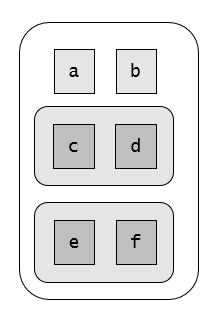

```{r setup, include=FALSE}
knitr::opts_chunk$set(echo = TRUE)
library(tidyverse)
```

# 20.3 Important types of atomic vector

## 20.3.5 Exercises

1. Describe the difference between `is.finite(x)` and `!is.infinite(x)`

`!is.infinite(x)` will return `TRUE` when input is `NA`.

2. Read the source code for `dplyr::near()` (Hint: to see the source code, drop the `()`). How does it work?

It checks that the difference between each element in vectors `x` and `y` is less that a certain tolerance threshold (`tol`).

3. A logical vector can take 3 possible values. How many possible values can an integer vector take? How many possible values can a double take? Use google to do some research.

An integer can take around `4 * 10^9` (`+/- 2*10^9`).

A double can take values between from about `2e-308` to `2e+308`. The exact boundaries are given by the hardware in which R is running on and can be seen in `.Machine$double.xmin` and `.Machine$double.xmax`. 

4. Brainstorm at least four functions that allow you to convert a double to an integer. How do they differ? Be precise.

Using `as.integer` directly

```{r eval = FALSE}
as.integer(x)
```

Using integer division, then `as.integer`

```{r}
to_integer_1 <- function(x) {
  integer_division <- x %/% 1
  as.integer(integer_division)
}
```

Using `round`, then `as.integer`

```{r}
to_integer_2 <- function(x) {
  as.integer(round(x))
}
```

Using `ceiling`, then `as.integer`

```{r}
to_integer_3 <- function(x) {
  as.integer(ceiling(x))
}
```

Showing their differences

```{r}
x <- c(-Inf, NaN, 0, 1, 1.2, 1.5, 1.7, NA)

as.integer(x)
to_integer_1(x)
to_integer_2(x)
to_integer_3(x)

```

The round division function produces the same results as just using `as.integer` (both functions truncate the decimal part), but it doesn't show a warning when the argument contains `Inf` or `-Inf`.

The round function approximates to the next bigger integer when the decimal part is more than 0.5, and the ceiling function approximates to the next integer when the decimal part is more than 0.

5. What functions from the readr package allow you to turn a string into logical, integer, and double vector?

`readr::parse_logical`

`readr::parse_integer`

`readr::parse_double`

# 20.4 Using atomic vectors

## 20.4.6 Exercises

1. What does `mean(is.na(x))` tell you about a vector `x`? What about `sum(!is.finite(x))`?

`mean(is.na(x))` shows the missing values ratio in a vector.

`sum(!is.finite(x))` tell us how many non finite values (such as `Inf`, `-Inf`, `NaN` and `NA`) there is in a vector.

2. Carefully read the documentation of `is.vector()`. What does it actually test for? Why does `is.atomic()` not agree with the definition of atomic vectors above?

`is.vector()` tests the absence of atributes other than name in the vector. So, it can return `TRUE` for lists, and `FALSE` for vectors which have other attributes (such as factors).

```{r}
is.vector(list(a = "a", b = 1))
```

`is.atomic()` think that `NULL` is an atomic vector type, and this does not match the definition of atomic vector given in the book.

3. Compare and contrast `setNames()` with `purrr::set_names()`.

`purrr::set_names()` has a different default arguments. While in `setNames()` the user can provide just a vector of names and obtain a vector with those names replicated also as values, `purrr::set_names()` always requiere a vector or object to name/rename, and allows omiting the names vector (in this case the object values are used as names).

Also, `purrr::set_names()` is more flexible, since it allows to supply the names in separate elements through `...` (instead of a single vector), or even to use a formula that modifies the original names of the object. 

4. Create functions that take a vector as input and returns:

  1. The last value. Should you use `[` or `[[`?
  
```{r}
x <- 1:10

y <- list(1:3, 4:6)

last_element <- function(x) {
  x[[length(x)]]
}

last_element(x)
last_element(y)
```
  We should use `[[` in order to return the last value for recursive vectors (instead of a list containing the last value).

  2. The elements at even numbered positions.
  
```{r}
even_positions <- function(x) {
  positions <- seq_along(x)
  even_pos <- (positions %% 2 == 0)
  x[even_pos]
}

```

  3. Every element except the last value.
  
```{r}
minus_last <- function(x) {
  positions <- seq_along(x)
  not_last <- positions != length(x)
  x[not_last]
}
```
  

  4. Only even numbers (and no missing values).
  
```{r}
even_numbers <- function(x) {
  is_even <- x %% 2 == 0
  not_na <- !is.na(x)
  
  x[is_even & not_na]
}

```
  

5. Why is `x[-which(x > 0)]` not the same as `x[x <= 0]`?

`x[x <= 0]` will convert `NaN` values in `NA`, since we "don't know" if `NaN` is less or equal than zero. However, `x[-which(x > 0)]` will return  the original `NaN` values. Why? Because in the expression we're just excluding all the values where `x > 0` evaluates to `TRUE` (or viceversa, keeping "as is" the values where `x > 0` evaluates to anything else). Since `NaN > 0` doesn't evaluates to `TRUE`, the value is returned without being converted to `NA`.

6. What happens when you subset with a positive integer that's bigger than the length of the vector? What happens when you subset with a name that doesn't exist?

It return a missing value (`NA`).

```{r}
x <- 1:10
x[20]
x["hola"]
```

# 20.5 Recursive vectors (lists)

## 20.5.4 Exercises

1. Draw the following lists as nested sets:

    list(a, b, list(c, d), list(e, f))



    list(list(list(list(list(list(a))))))
    

    
2. What happens if you subset a tibble as if you're subsetting a list? What are the key differences between a list and a tibble?

Subsetting should work the same way for tibbles and lists most of the time, since tibbles are just augmented lists. See below:

```{r}
mtcars <- tibble::as_tibble(mtcars)

mtcars[1:2] #should return a tibble (list) with two columns (atomic vectors)
mtcars[3:4][1] #should return a tibble with the first column from a tibble with the 3rd and 4th columns of mtcars
mtcars[[1]] #should extract the first element of the tibble as an atomic vector
mtcars[["cyl"]] #should extract the element (column) named "cyl" as an atomic vector
mtcars[["cyl"]][3:6] #should extract the column "cyl" as a an atomic vector, then extract the 3rd to 6th elements from the vector
```

The key difference between a tibble and a ordinary list is that tibble elements should have the same length.  

# 20.7 Augmented vectors

## 20.7.4 Exercises 

1. What does `hms::hms(3600)` return? How does it print? What primitive type is the augmented vector built on top of? What attributes does it use?

It returns an atomic double vector with classes "hms" and "diffftime". The returned vector also has an attribute which specifies a unit of time (seconds). It gets printed as a period of time in format hh:mm:ss.

2. Try and make a tibble that has columns with different lengths. What happens?

```{r, error=TRUE}
tibble(
  a = 1:10,
  b = 1:20,
  c = 1:15
)
```

It throws an error indicating that all columns should have length 1, or equal to the longest column.

3. Based on the definition above, is it ok to have a list as a column of a tibble?

Yes! As long as the list has the same length as the other columns.

```{r}
tibble(
  a = list(1:2, 3:7), 
  b = c("first", "second"))
```

