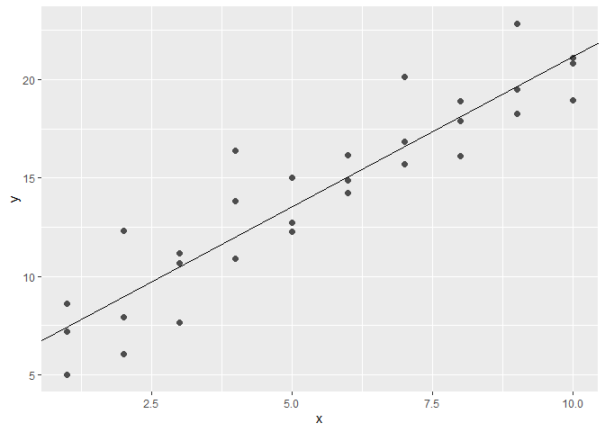
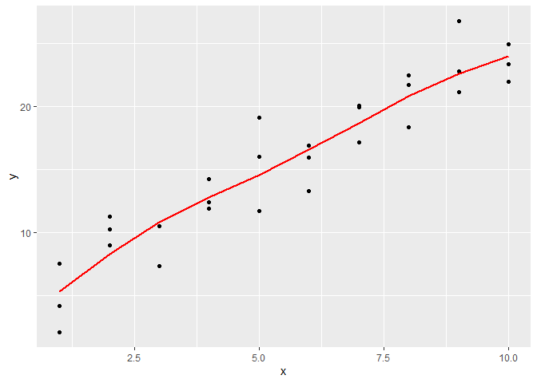
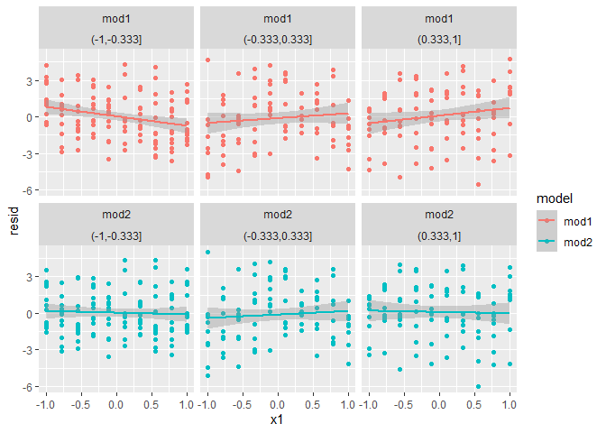
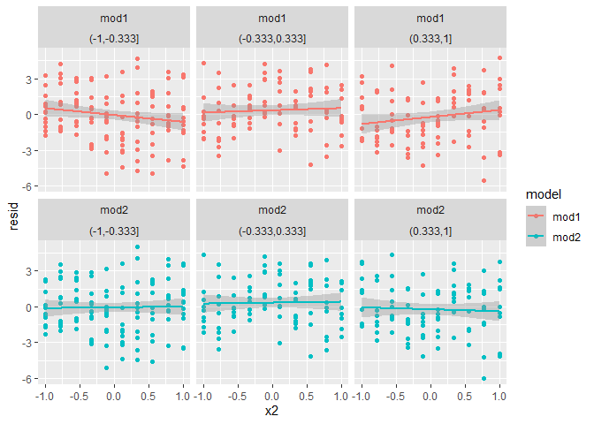

Chapter 23 - Exercises - R for Data Science
================
Francisco Yira Albornoz
December 5th 2018

-   [23.2 A simple model](#232-a-simple-model)
    -   [23.2.1 Exercises](#2321-exercises)
-   [23.3 Visualising models](#233-visualising-models)
    -   [23.3.3 Exercises](#2333-exercises)
-   [23.4 Formulas and model families](#234-formulas-and-model-families)
    -   [23.4.5 Exercises](#2345-exercises)

## 23.2 A simple model

### 23.2.1 Exercises

1.  One downside of the linear model is that it is sensitive to unusual
    values because the distance incorporates a squared term. Fit a
    linear model to the simulated data below, and visualise the results.
    Rerun a few times to generate different simulated datasets. What do
    you notice about the model?

``` r
sim1a <- tibble(
  x = rep(1:10, each = 3),
  y = x * 1.5 + 6 + rt(length(x), df = 2)
)

model_sim1a <- lm(y ~ x, data = sim1a)

(coefs_model <- coef(model_sim1a))
```

    ## (Intercept)           x 
    ##    5.930052    1.528387

``` r
ggplot(sim1a, aes(x, y)) +
  geom_point(size = 2, colour = "grey30") +
  geom_abline(intercept = coefs_model[[1]], slope = coefs_model[[2]])
```

<!-- -->

The “true model” (the one which generated the data) has an intercept
equal to 6 and a slope equal to 1.5. However, most of the times the
estimated parameters are a little offset from those true values, because
of the deviations introduced by adding values generated by a t-sudent
distribution (with mean equal to zero).

This problem is more serious here because the the t-student distribution
has “fat tails” (a relatively higher likelihood of generating extreme
values).

2.  One way to make linear models more robust is to use a different
    distance measure. For example, instead of root-mean-squared
    distance, you could use mean-absolute distance:

``` r
measure_distance2 <- function(mod, data) {
  diff <- data$y - model1(mod, data)
  mean(abs(diff))
}
```

Use `optim()` to fit this model to the simulated data above and compare
it to the linear model.

``` r
best <- optim(c(0, 0), measure_distance2, data = sim1a)
best$`par`
```

    ## [1] 5.655264 1.536608

``` r
coefs_model
```

    ## (Intercept)           x 
    ##    5.930052    1.528387

The estimations are not very different when using the mean-absolute
distance.

3.  One challenge with performing numerical optimisation is that it’s
    only guaranteed to find one local optimum. What’s the problem with
    optimising a three parameter model like this?

``` r
model1 <- function(a, data) {
  a[1] + data$x * a[2] + a[3]
}
```

In this case maybe there is several local optimums, from which only one
would be the global optimum. It’s also possible that `optim()` gets
stuck on one of those local optimums and fails to find the global
optimum.

## 23.3 Visualising models

### 23.3.3 Exercises

1.  Instead of using `lm()` to fit a straight line, you can use
    `loess()` to fit a smooth curve. Repeat the process of model
    fitting, grid generation, predictions, and visualisation on sim1
    using `loess()` instead of `lm()`. How does the result compare to
    `geom_smooth()`?

``` r
model_loess <- loess(y ~ x, data = sim1)

grid_loess <- sim1 %>% 
  data_grid(x)

grid_loess <- grid_loess %>% 
  add_predictions(model_loess)

ggplot(sim1, aes(x = x, y = y)) +
  geom_point() +
  geom_line(aes(y = pred), data = grid_loess, colour = "red", size = 1)
```

<!-- -->

``` r
sim1_loess <- sim1 %>% 
  add_residuals(model_loess)

sim1_lm <- sim1 %>% 
  add_residuals(model_sim1a)

sim1_both <- 
  bind_rows(sim1_loess, sim1_lm, .id = "model") %>% 
  mutate(model = ifelse(model == 1,
                         yes = "loess",
                         no = "lm"))

ggplot(sim1_both, aes(x = resid, color = model)) +
  geom_freqpoly(binwidth = 0.5)
```

<!-- -->

``` r
ggplot(sim1_both, aes(x = x, y = resid, color = model)) +
  geom_jitter() +
  geom_ref_line(h = 0)
```

<!-- -->

Overall the results of both models are very similar.

2.  `add_predictions()` is paired with `gather_predictions()` and
    `spread_predictions()`. How do these three functions differ?

`add_predictions()` generates only 1 column of predictions using a
single model. `gather_predictions()` and `spread_predictions()` can
insert predictions using multiple models, but they differ in the format
in which those predictions are added to the dataset.
`spred_predictions()` creates one column of predictions per model, and
doesn’t add new rows. `gather_predictions()` adds two columns: one with
predictions, and other with a model id, and repeats the input rows for
each model.

3.  What does `geom_ref_line()` do? What package does it come from? Why
    is displaying a reference line in plots showing residuals useful and
    important?

It adds a reference line to the plot, and comes from the `modelr`
package. It’s useful to show a reference line when plotting residuals
because it allows to visually check how they are distributed around
zero.

4.  Why might you want to look at a frequency polygon of absolute
    residuals? What are the pros and cons compared to looking at the raw
    residuals?

To check if the residuals are centered around zero, and also look at how
big are the deviations from zero. This visualization offers us a more
concise view of how the residuals are distributed. However, a problem of
looking at this graph (instead of a scatter plot showing residuals
against `x`) is that we can not see if there is variations in the
residuals patterns for different levels of `x.`

## 23.4 Formulas and model families

### 23.4.5 Exercises

1.  What happens if you repeat the analysis of `sim2` using a model
    without an intercept. What happens to the model equation? What
    happens to the predictions?

``` r
mod2_no_int <- lm(y ~ x - 1, data = sim2)
mod2 <- lm(y ~ x, data = sim2)

model_matrix(sim2, y ~ x - 1)
```

    ## # A tibble: 40 x 4
    ##       xa    xb    xc    xd
    ##    <dbl> <dbl> <dbl> <dbl>
    ##  1     1     0     0     0
    ##  2     1     0     0     0
    ##  3     1     0     0     0
    ##  4     1     0     0     0
    ##  5     1     0     0     0
    ##  6     1     0     0     0
    ##  7     1     0     0     0
    ##  8     1     0     0     0
    ##  9     1     0     0     0
    ## 10     1     0     0     0
    ## # ... with 30 more rows

``` r
model_matrix(sim2, y ~ x)
```

    ## # A tibble: 40 x 4
    ##    `(Intercept)`    xb    xc    xd
    ##            <dbl> <dbl> <dbl> <dbl>
    ##  1             1     0     0     0
    ##  2             1     0     0     0
    ##  3             1     0     0     0
    ##  4             1     0     0     0
    ##  5             1     0     0     0
    ##  6             1     0     0     0
    ##  7             1     0     0     0
    ##  8             1     0     0     0
    ##  9             1     0     0     0
    ## 10             1     0     0     0
    ## # ... with 30 more rows

``` r
sim2 %>% 
  spread_predictions(mod2_no_int, mod2)
```

    ## # A tibble: 40 x 4
    ##    x          y mod2_no_int  mod2
    ##    <chr>  <dbl>       <dbl> <dbl>
    ##  1 a      1.94         1.15  1.15
    ##  2 a      1.18         1.15  1.15
    ##  3 a      1.24         1.15  1.15
    ##  4 a      2.62         1.15  1.15
    ##  5 a      1.11         1.15  1.15
    ##  6 a      0.866        1.15  1.15
    ##  7 a     -0.910        1.15  1.15
    ##  8 a      0.721        1.15  1.15
    ##  9 a      0.687        1.15  1.15
    ## 10 a      2.07         1.15  1.15
    ## # ... with 30 more rows

Predictions are the same when we specify the model without an intercept,
and in both cases the model equation uses 4 variables or predictors. The
difference is that in the model with intercept one of the binary
variables (the one for the category a) is dropped because their values
are perfectly predictable based on the other columns (the Intercept and
categories b, c, and d).

No including the intercept in the second model allows this variable to
stay in the final estimation.

2.  Use `model_matrix()` to explore to explore the equations generated
    for the models I fit to `sim3` and `sim4`. Why is `*` a good
    shorthand for interaction?

``` r
model_matrix(sim3, y ~ x1 + x2)
```

    ## # A tibble: 120 x 5
    ##    `(Intercept)`    x1   x2b   x2c   x2d
    ##            <dbl> <dbl> <dbl> <dbl> <dbl>
    ##  1             1     1     0     0     0
    ##  2             1     1     0     0     0
    ##  3             1     1     0     0     0
    ##  4             1     1     1     0     0
    ##  5             1     1     1     0     0
    ##  6             1     1     1     0     0
    ##  7             1     1     0     1     0
    ##  8             1     1     0     1     0
    ##  9             1     1     0     1     0
    ## 10             1     1     0     0     1
    ## # ... with 110 more rows

``` r
model_matrix(sim3, y ~ x1 * x2)
```

    ## # A tibble: 120 x 8
    ##    `(Intercept)`    x1   x2b   x2c   x2d `x1:x2b` `x1:x2c` `x1:x2d`
    ##            <dbl> <dbl> <dbl> <dbl> <dbl>    <dbl>    <dbl>    <dbl>
    ##  1             1     1     0     0     0        0        0        0
    ##  2             1     1     0     0     0        0        0        0
    ##  3             1     1     0     0     0        0        0        0
    ##  4             1     1     1     0     0        1        0        0
    ##  5             1     1     1     0     0        1        0        0
    ##  6             1     1     1     0     0        1        0        0
    ##  7             1     1     0     1     0        0        1        0
    ##  8             1     1     0     1     0        0        1        0
    ##  9             1     1     0     1     0        0        1        0
    ## 10             1     1     0     0     1        0        0        1
    ## # ... with 110 more rows

``` r
model_matrix(sim4, y ~ x1 + x2)
```

    ## # A tibble: 300 x 3
    ##    `(Intercept)`    x1     x2
    ##            <dbl> <dbl>  <dbl>
    ##  1             1    -1 -1    
    ##  2             1    -1 -1    
    ##  3             1    -1 -1    
    ##  4             1    -1 -0.778
    ##  5             1    -1 -0.778
    ##  6             1    -1 -0.778
    ##  7             1    -1 -0.556
    ##  8             1    -1 -0.556
    ##  9             1    -1 -0.556
    ## 10             1    -1 -0.333
    ## # ... with 290 more rows

``` r
model_matrix(sim4, y ~ x1 * x2)
```

    ## # A tibble: 300 x 4
    ##    `(Intercept)`    x1     x2 `x1:x2`
    ##            <dbl> <dbl>  <dbl>   <dbl>
    ##  1             1    -1 -1       1    
    ##  2             1    -1 -1       1    
    ##  3             1    -1 -1       1    
    ##  4             1    -1 -0.778   0.778
    ##  5             1    -1 -0.778   0.778
    ##  6             1    -1 -0.778   0.778
    ##  7             1    -1 -0.556   0.556
    ##  8             1    -1 -0.556   0.556
    ##  9             1    -1 -0.556   0.556
    ## 10             1    -1 -0.333   0.333
    ## # ... with 290 more rows

The `*` operator is a good shorthand for interactions because it is a
concise representation for including both the original variables, as
well as the multiplication between them, saving us from writing each
variable twice.

3.  Using the basic principles, convert the formulas in the following
    two models into functions. (Hint: start by converting the
    categorical variable into 0-1 variables.)

<!-- -->

    mod1 <- lm(y ~ x1 + x2, data = sim3)
    mod2 <- lm(y ~ x1 * x2, data = sim3)

``` r
mod1_matrix <- function(data) {
  data %>% 
    mutate(Intercept = 1,
           x2b = ifelse(x2 == "b", yes = 1, no = 0),
           x2c = ifelse(x2 == "c", yes = 1, no = 0),
           x2d = ifelse(x2 == "d", yes = 1, no = 0)) %>% 
    select(Intercept, x1, starts_with("x2"), -x2)
  
}

mod1_matrix(sim3)
```

    ## # A tibble: 120 x 5
    ##    Intercept    x1   x2b   x2c   x2d
    ##        <dbl> <int> <dbl> <dbl> <dbl>
    ##  1         1     1     0     0     0
    ##  2         1     1     0     0     0
    ##  3         1     1     0     0     0
    ##  4         1     1     1     0     0
    ##  5         1     1     1     0     0
    ##  6         1     1     1     0     0
    ##  7         1     1     0     1     0
    ##  8         1     1     0     1     0
    ##  9         1     1     0     1     0
    ## 10         1     1     0     0     1
    ## # ... with 110 more rows

``` r
mod2_matrix <- function(data) {
  data %>% 
    mutate(Intercept = 1,
           x2b = ifelse(x2 == "b", yes = 1, no = 0),
           x2c = ifelse(x2 == "c", yes = 1, no = 0),
           x2d = ifelse(x2 == "d", yes = 1, no = 0),
           `x1:x2b` = x1 * x2b,
           `x1:x2c` = x1 * x2c,
           `x1:x2d` = x1 * x2d) %>%
    select(Intercept, x1, starts_with("x2"), starts_with("x1"), -x2)
  
}

mod2_matrix(sim3)
```

    ## # A tibble: 120 x 8
    ##    Intercept    x1   x2b   x2c   x2d `x1:x2b` `x1:x2c` `x1:x2d`
    ##        <dbl> <int> <dbl> <dbl> <dbl>    <dbl>    <dbl>    <dbl>
    ##  1         1     1     0     0     0        0        0        0
    ##  2         1     1     0     0     0        0        0        0
    ##  3         1     1     0     0     0        0        0        0
    ##  4         1     1     1     0     0        1        0        0
    ##  5         1     1     1     0     0        1        0        0
    ##  6         1     1     1     0     0        1        0        0
    ##  7         1     1     0     1     0        0        1        0
    ##  8         1     1     0     1     0        0        1        0
    ##  9         1     1     0     1     0        0        1        0
    ## 10         1     1     0     0     1        0        0        1
    ## # ... with 110 more rows

4.  For `sim4`, which of `mod1` and `mod2` is better? I think mod2 does
    a slightly better job at removing patterns, but it’s pretty subtle.
    Can you come up with a plot to support my claim?

``` r
mod1 <- lm(y ~ x1 + x2, data = sim4)
mod2 <- lm(y ~ x1 * x2, data = sim4)

grid <- sim4 %>% 
  data_grid(
    x1 = seq_range(x1, 5), 
    x2 = seq_range(x2, 5) 
  ) %>% 
  gather_predictions(mod1, mod2)

sim4_resid <-
  sim4 %>% 
  gather_residuals(mod1, mod2) %>% 
  mutate(range_x1 = cut(x1, breaks = 3),
         range_x2 = cut(x2, breaks = 3))

ggplot(sim4_resid, aes(x = x1, y = resid, color = model)) +
  geom_point() +
  geom_smooth(method = "lm") +
  facet_wrap(model ~ range_x2)
```

    ## `geom_smooth()` using formula = 'y ~ x'

<!-- -->

``` r
ggplot(sim4_resid, aes(x = x2, y = resid, color = model)) +
  geom_point() +
  geom_smooth(method = "lm") +
  facet_wrap(model ~ range_x1)
```

    ## `geom_smooth()` using formula = 'y ~ x'

<!-- -->

In these plots we see that, faceting either by x1 or x2, and then
plotting the residuals against the remaining continious variable, the
model 2 (with interactions) does a better job at capturing existing
patterns, while in model 1 we can still see some subtle patterns in the
residuals.
