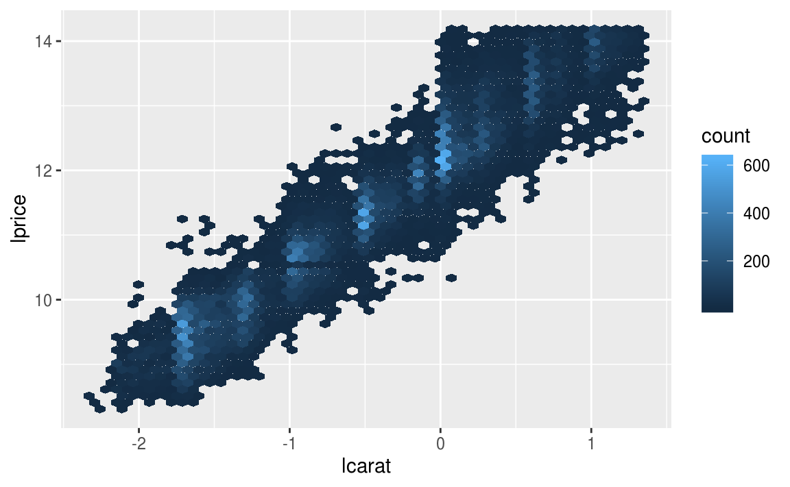

```{r setup, include=FALSE}
knitr::opts_chunk$set(echo = TRUE)
library(tidyverse)
library(modelr)
options(na.action = na.warn)

library(nycflights13)
library(lubridate)
```


## 24.2 Why are low quality diamonds more expensive?

### 24.3.3 Exercises

1. In the plot of `lcarat` vs. `lprice`, there are some bright vertical strips. What do they represent?




https://r4ds.had.co.nz/model-building.html#exercises-63 