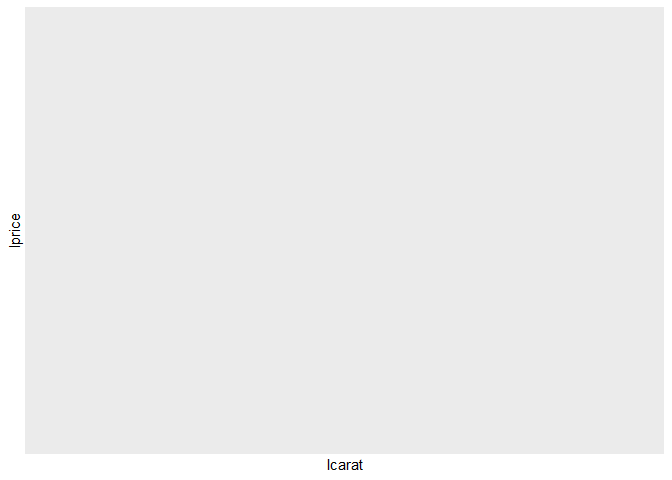
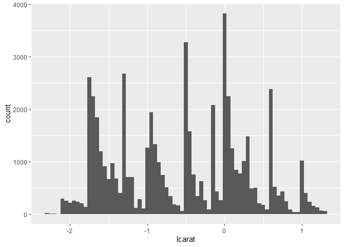
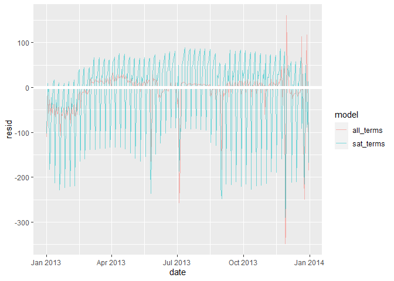
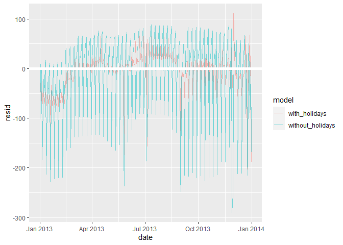
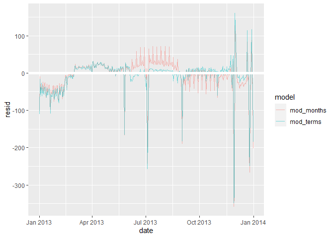
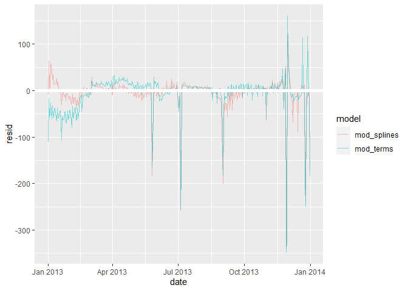
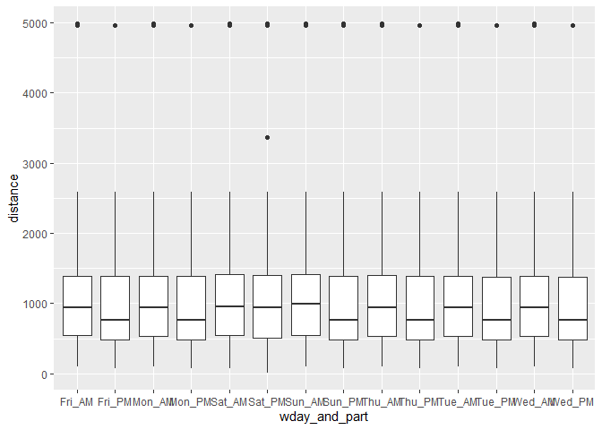
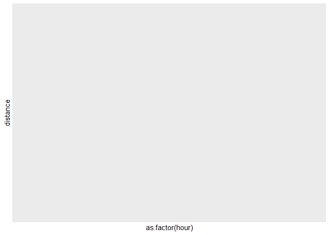
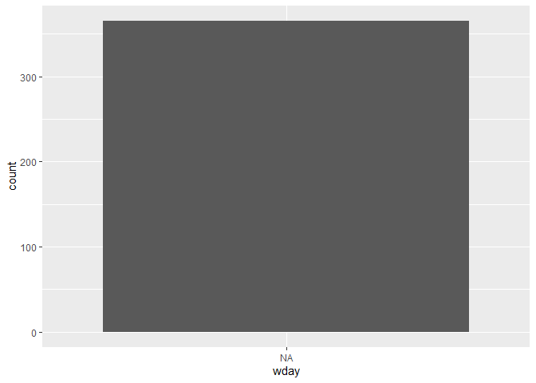

Chapter 24 - Exercises - R for Data Science
================
Francisco Yira Albornoz
December 13th, 2018

-   [24.2 Why are low quality diamonds more
    expensive?](#242-why-are-low-quality-diamonds-more-expensive)
    -   [24.2.3 Exercises](#2423-exercises)
-   [24.3 What affects the number of daily
    flights?](#243-what-affects-the-number-of-daily-flights)
    -   [24.3.3 Exercises](#2433-exercises)

## 24.2 Why are low quality diamonds more expensive?

### 24.2.3 Exercises

1.  In the plot of `lcarat` vs. `lprice`, there are some bright vertical
    strips. What do they represent?

``` r
diamonds2 <- diamonds %>% 
  filter(carat <= 2.5) %>% 
  mutate(lprice = log2(price), lcarat = log2(carat))

ggplot(diamonds2, aes(lcarat, lprice)) + 
  geom_hex(bins = 50)
```

    ## Warning: Computation failed in `stat_binhex()`:

<!-- -->

``` r
ggplot(diamonds2, aes(x = lcarat)) +
  geom_histogram(binwidth = 0.05)
```

<!-- -->

It looks like bright areas in the first plot represent peaks or
concentracions in the distribution of `lcarat` variable. Since data is
asymetrically distributed around these concentrations, they may be
caused by caused by “upward rounding” in data entry.

2.  If `log(price) = a_0 + a_1 * log(carat)`, what does that say about
    the relationship between `price` and `carat`?

It means that `price` grows as `carat` grows following the relationship
`e^(a_0) * carat^(a_1)`.

3.  Extract the diamonds that have very high and very low residuals. Is
    there anything unusual about these diamonds? Are they particularly
    bad or good, or do you think these are pricing errors?

``` r
mod_diamond2 <- lm(lprice ~ lcarat + color + cut + clarity, data = diamonds2)

diamonds2 <- diamonds2 %>% 
  add_residuals(mod_diamond2, "lresid2")

diamonds2 %>% 
  filter(abs(lresid2) > 1) %>% 
  add_predictions(mod_diamond2) %>% 
  mutate(pred = round(2 ^ pred)) %>% 
  select(price, pred, carat:table, x:z) %>% 
  arrange(price)
```

    ## # A tibble: 16 x 11
    ##    price  pred carat cut       color clarity depth table     x     y     z
    ##    <int> <dbl> <dbl> <ord>     <ord> <ord>   <dbl> <dbl> <dbl> <dbl> <dbl>
    ##  1  1013   264  0.25 Fair      F     SI2      54.4    64  4.3   4.23  2.32
    ##  2  1186   284  0.25 Premium   G     SI2      59      60  5.33  5.28  3.12
    ##  3  1186   284  0.25 Premium   G     SI2      58.8    60  5.33  5.28  3.12
    ##  4  1262  2644  1.03 Fair      E     I1       78.2    54  5.72  5.59  4.42
    ##  5  1415   639  0.35 Fair      G     VS2      65.9    54  5.57  5.53  3.66
    ##  6  1415   639  0.35 Fair      G     VS2      65.9    54  5.57  5.53  3.66
    ##  7  1715   576  0.32 Fair      F     VS2      59.6    60  4.42  4.34  2.61
    ##  8  1776   412  0.29 Fair      F     SI1      55.8    60  4.48  4.41  2.48
    ##  9  2160   314  0.34 Fair      F     I1       55.8    62  4.72  4.6   2.6 
    ## 10  2366   774  0.3  Very Good D     VVS2     60.6    58  4.33  4.35  2.63
    ## 11  3360  1373  0.51 Premium   F     SI1      62.7    62  5.09  4.96  3.15
    ## 12  3807  1540  0.61 Good      F     SI2      62.5    65  5.36  5.29  3.33
    ## 13  3920  1705  0.51 Fair      F     VVS2     65.4    60  4.98  4.9   3.23
    ## 14  4368  1705  0.51 Fair      F     VVS2     60.7    66  5.21  5.11  3.13
    ## 15 10011  4048  1.01 Fair      D     SI2      64.6    58  6.25  6.2   4.02
    ## 16 10470 23622  2.46 Premium   E     SI2      59.7    59  8.82  8.76  5.25

They mostly look like pricing errors. The prices predicted by the model
are reasonable given all other variables. However, these low/high
residuals could be a syntom of non-linear or interactive effects of some
variables on diamonds price.

4.  Does the final model, `mod_diamond2`, do a good job of predicting
    diamond prices? Would you trust it to tell you how much to spend if
    you were buying a diamond?

It appropriately captures the linear effects of the variables that
affect the price, and since there are relatively few observations with
large residuals, we could say that non-linear effects and interactions
are not relevant in most cases. I would say the the final model sets a
good benchmark of how much should we expect to pay for a diamond of
certain characteristics.

## 24.3 What affects the number of daily flights?

### 24.3.3 Exercises

1.  Use your Google sleuthing skills to brainstorm why there were fewer
    than expected flights on Jan 20, May 26, and Sep 1. (Hint: they all
    have the same explanation.) How would these days generalise to
    another year?

There were fewer flights in those days because they were close to Martin
Luther King day, trinity Sunday and Labor day. The specific date in
which these holidays fall depends on the weekdays of each year, so to
generalise them to other years we need to keep that in mind.

2.  What do the three days with high positive residuals represent? How
    would these days generalise to another year?

``` r
daily <- flights %>% 
  mutate(date = make_date(year, month, day)) %>% 
  group_by(date) %>% 
  summarise(n = n()) %>% 
  mutate(wday = wday(date, label = TRUE))


term <- function(date) {
  cut(date,
      breaks = ymd(20130101, 20130605, 20130825, 20140101),
      labels = c("spring", "summer", "fall"))
}

daily <- daily %>% 
  mutate(term = term(date))

library(MASS)
```

    ## 
    ## Attaching package: 'MASS'

    ## The following object is masked from 'package:dplyr':
    ## 
    ##     select

``` r
mod <- MASS::rlm(n ~ wday * term, data = daily)

daily <- daily %>% 
  add_residuals(mod, "resid")

daily %>% 
  top_n(3, resid) 
```

    ## # A tibble: 3 x 5
    ##   date           n wday  term  resid
    ##   <date>     <int> <ord> <fct> <dbl>
    ## 1 2013-11-30   857 Sat   fall   160.
    ## 2 2013-12-21   811 Sat   fall   114.
    ## 3 2013-12-28   814 Sat   fall   117.

These are the days after Thanksgiving (2013-11-28) and Christmas
(2013-12-25). To generalise Thanksgiving to other years we should look
for the fourth thursday of november. To generalise the peak after
christmas we should simply look for the day after 25 Dec.

3.  Create a new variable that splits the wday variable into terms, but
    only for Saturdays, i.e. it should have `Thurs`, `Fri`, but
    `Sat-summer`, `Sat-spring`, `Sat-fall`. How does this model compare
    with the model with every combination of wday and term?

``` r
daily <- daily %>% 
  mutate(wday2 = ifelse(wday == "sab\\.",
                         yes = str_c(wday, term),
                         no = wday))

mod2 <- MASS::rlm(n ~ wday2, data = daily)

daily %>% 
  gather_residuals(all_terms = mod, sat_terms = mod2) %>% 
  ggplot(aes(x = date, y = resid, color = model)) +
  geom_line(alpha = 0.5) +
  geom_ref_line(h = 0)
```

<!-- -->

It looks like the model with terms interactions in all weekdays performs
better in summer, but worse in late-spring.

4.  Create a new `wday` variable that combines the day of week, term
    (for Saturdays), and public holidays. What do the residuals of that
    model look like?

``` r
holidays <- lubridate::ymd(20130101, 20130121, 20130218, 20130416, 20130512, 20130527, 20130616, 20130704, 20130902, 20131014, 20131111, 20131128, 20131129, 20131225)

daily <- daily %>% 
  mutate(wday3 = if_else(
    date %in% holidays,
    str_c(wday2, "_holiday"),
    as.character(wday2)
  ))

mod3 <- MASS::rlm(n ~ wday3, data = daily)

daily %>% 
  gather_residuals(without_holidays = mod2, with_holidays = mod3) %>% 
  ggplot(aes(x = date, y = resid, color = model)) +
  geom_line(alpha = 0.5) +
  geom_ref_line(h = 0)
```

<!-- -->

The model estimates, in average, a positive and large effect due to
holiday days. This helps to reduce residuals in some holidays which
actually have more air traffic. However, in other days we see larger
residuals since they correspond to holidays when air traffic doesn’t
increase so much.

5.  What happens if you fit a day of week effect that varies by month
    (i.e. `n ~ wday * month`)? Why is this not very helpful?

``` r
daily <- daily %>% 
  mutate(month = month(date))

mod4 <- MASS::rlm(n ~ wday * month(date), data = daily)

daily %>% 
  gather_residuals(mod_terms = mod, mod_months = mod4) %>% 
  ggplot(aes(x = date, y = resid, color = model)) +
  geom_line(alpha = 0.5) +
  geom_ref_line(h = 0)
```

<!-- -->

In some periods the second model has larger residuals, this may be due
to higher sensitivity to outliers.

6.  What would you expect the model `n ~ wday + ns(date, 5)` to look
    like? Knowing what you know about the data, why would you expect it
    to be not particularly effective?

``` r
library(splines)
mod_sp <- MASS::rlm(n ~ wday * ns(date, 5), data = daily)

daily %>% 
  gather_residuals(mod_terms = mod, mod_splines = mod_sp) %>% 
  ggplot(aes(x = date, y = resid, color = model)) +
  geom_line(alpha = 0.5) +
  geom_ref_line(h = 0)
```

<!-- -->

This new model is not clearly better than our original model with
interactions between `wday` and `term`. A reason for this could be that
it tries to fit smooth curves the data, but we see that there are abrupt
changes in air traffic in some periods.

7.  We hypothesised that people leaving on Sundays are more likely to be
    business travellers who need to be somewhere on Monday. Explore that
    hypothesis by seeing how it breaks down based on distance and time:
    if it’s true, you’d expect to see more Sunday evening flights to
    places that are far away.

``` r
flights %>% 
  mutate(date = make_date(year, month, day),
         wday = wday(date, label = TRUE),
         time = make_datetime(year, month, day, dep_time %/% 100, dep_time %% 100),
         part_day = case_when(
           dep_time < 1200 ~ "AM",
           TRUE ~ "PM"
         ),
         wday_and_part = str_c(wday, part_day, sep = "_")) %>% 
  ggplot(aes(x = wday_and_part, y = distance)) +
  geom_boxplot()
```

<!-- -->

It looks like the median distance is actually higher in Sunday morning
(not Sunday evening).

An alternative way to test this hypothesis could be a plot of distance
traveled (in Sunday) against hours left to midnight.

``` r
flights %>% 
  mutate(date = make_date(year, month, day),
         wday = wday(date, label = TRUE),
         hour = dep_time %/% 100) %>% 
  filter(wday == "dom\\.") %>% 
  ggplot(aes(x = as.factor(hour), y = distance)) +
  geom_boxplot()
```

<!-- -->

We see a subtle increase in distance travelled around 17 and 19 hr. of
Sunday.

8.  It’s a little frustrating that Sunday and Saturday are on separate
    ends of the plot. Write a small function to set the levels of the
    factor so that the week starts on Monday.

``` r
order_wdays <- function(data) {
  data %>%
    mutate(wday = factor(
      wday,
      levels = c(
        "lun\\.",
        "mar\\.",
        "mie\\.",
        "jue\\.",
        "vie\\.",
        "sab\\.",
        "dom\\."
      )
    ))
}

daily %>% order_wdays() %>% 
  ggplot(aes(x = wday)) +
  geom_bar()
```

<!-- -->
