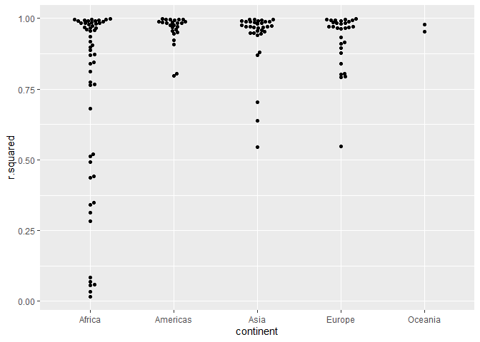
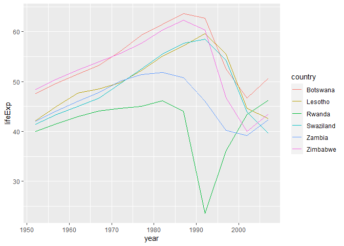

Chapter 25 - Exercises - R for Data Science
================
Francisco Yira Albornoz
February 8th, 2019

-   [25.2 gapminder](#252-gapminder)
    -   [25.2.5 Exercises](#2525-exercises)
-   [25.4 Creating list-columns](#254-creating-list-columns)
    -   [25.4.5 Exercises](#2545-exercises)
-   [25.5 Simplifying list-columns](#255-simplifying-list-columns)
    -   [25.5.5 Exercises](#2555-exercises)

## 25.2 gapminder

### 25.2.5 Exercises

1.  A linear trend seems to be slightly too simple for the overall
    trend. Can you do better with a quadratic polynomial? How can you
    interpret the coefficients of the quadratic? (Hint you might want to
    transform `year` so that it has mean zero.)

``` r
by_country <- gapminder %>% 
  mutate(year_centered = year - mean(year)) %>%
  group_by(country, continent) %>% 
  nest()

simple_model <- function(df) {
  lm(lifeExp ~ year, data = df)
}

quadratic_model <- function(df) {
  lm(lifeExp ~ poly(year, 2), data = df)
}

by_country <- by_country %>% 
  mutate(
    simple_model = map(data, simple_model),
    quadratic_model = map(data, quadratic_model)
  )

by_country <- by_country %>% 
  mutate(
    resids = pmap(list(data, simple_model = simple_model, quadratic_model = quadratic_model),
                  gather_residuals)
  )

resids <- unnest(by_country, resids)
```

``` r
resids %>% 
  group_by(year, model, continent) %>% 
  summarise(resid = mean(resid)) %>% 
  ggplot(aes(year, resid, color = model)) +
  geom_line(aes(group = model)) +
  facet_wrap(~continent)
```

    ## `summarise()` has grouped output by 'year', 'model'. You can override using the
    ## `.groups` argument.

<!-- -->

Most of the time the quadratic polynomial model has lower residuals than
the simple linear model.

A quadratic polynomial model has three coefficients: the Intercept, the
linear coefficient, and the quadratic term coefficient. The latter can
be interpreted as the effect associated with `year` squared, a
“modifier” on the linear trend that signals a changing effect with the
passage of time.

2.  Explore other methods for visualising the distribution of R2 per
    continent. You might want to try the ggbeeswarm package, which
    provides similar methods for avoiding overlaps as jitter, but uses
    deterministic methods.

``` r
glance_models <- 
  by_country %>% 
  mutate(glance = map(simple_model, broom::glance)) %>% 
  unnest(glance, .drop = TRUE)
```

    ## Warning: The `.drop` argument of `unnest()` is deprecated as of tidyr 1.0.0.
    ## All list-columns are now preserved.
    ## This warning is displayed once every 8 hours.
    ## Call `lifecycle::last_lifecycle_warnings()` to see where this warning was generated.

``` r
library(ggbeeswarm)
```

    ## Warning: package 'ggbeeswarm' was built under R version 4.1.3

``` r
glance_models %>% 
  ggplot(aes(continent, r.squared)) +
  geom_beeswarm()
```

<!-- -->

``` r
glance_models %>% 
  ggplot(aes(continent, r.squared)) +
  geom_quasirandom()
```

<!-- -->

3.  To create the last plot (showing the data for the countries with the
    worst model fits), we needed two steps: we created a data frame with
    one row per country and then semi-joined it to the original dataset.
    It’s possible to avoid this join if we use `unnest()` instead of
    `unnest(.drop = TRUE)`. How?

``` r
glance_models <- 
  by_country %>% 
  mutate(glance = map(simple_model, broom::glance)) %>% 
  unnest(glance)

glance_models %>% 
  filter(r.squared < 0.25) %>% 
  unnest(data) %>% 
  ggplot(aes(year, lifeExp, color = country)) +
  geom_line()
```

<!-- -->

## 25.4 Creating list-columns

### 25.4.5 Exercises

1.  List all the functions that you can think of that take a atomic
    vector and return a list.

<!-- -->

    map()
    list()
    read_csv()
    DBI::dbGetQuery()

2.  Brainstorm useful summary functions that, like `quantile()`, return
    multiple values.

<!-- -->

    summary()
    unique()
    seq_range()
    confint() # for models
    range()

3.  What’s missing in the following data frame? How does `quantile()`
    return that missing piece? Why isn’t that helpful here?

``` r
mtcars %>% 
  group_by(cyl) %>% 
  summarise(q = list(quantile(mpg))) %>% 
  unnest()
```

    ## Warning: `cols` is now required when using unnest().
    ## Please use `cols = c(q)`

    ## # A tibble: 15 x 2
    ##      cyl     q
    ##    <dbl> <dbl>
    ##  1     4  21.4
    ##  2     4  22.8
    ##  3     4  26  
    ##  4     4  30.4
    ##  5     4  33.9
    ##  6     6  17.8
    ##  7     6  18.6
    ##  8     6  19.7
    ##  9     6  21  
    ## 10     6  21.4
    ## 11     8  10.4
    ## 12     8  14.4
    ## 13     8  15.2
    ## 14     8  16.2
    ## 15     8  19.2

The names of the quantiles are missing. This is because `quantile()`
returns them as names of the values (inside a named vector), and
`unnest()` can’t retrieve that information. We can solve this issue by
converting the `quantile()` output into a dataframe which contains a
column with quantiles names.

``` r
mtcars %>% 
  group_by(cyl) %>% 
  summarise(q = list(enframe(quantile(mpg)))) %>% 
  unnest()
```

    ## Warning: `cols` is now required when using unnest().
    ## Please use `cols = c(q)`

    ## # A tibble: 15 x 3
    ##      cyl name  value
    ##    <dbl> <chr> <dbl>
    ##  1     4 0%     21.4
    ##  2     4 25%    22.8
    ##  3     4 50%    26  
    ##  4     4 75%    30.4
    ##  5     4 100%   33.9
    ##  6     6 0%     17.8
    ##  7     6 25%    18.6
    ##  8     6 50%    19.7
    ##  9     6 75%    21  
    ## 10     6 100%   21.4
    ## 11     8 0%     10.4
    ## 12     8 25%    14.4
    ## 13     8 50%    15.2
    ## 14     8 75%    16.2
    ## 15     8 100%   19.2

4.  What does this code do? Why might might it be useful?

``` r
mtcars %>% 
  group_by(cyl) %>% 
  summarise_each(funs(list))
```

    ## Warning: `summarise_each_()` was deprecated in dplyr 0.7.0.
    ## Please use `across()` instead.
    ## This warning is displayed once every 8 hours.
    ## Call `lifecycle::last_lifecycle_warnings()` to see where this warning was generated.

    ## Warning: `funs()` was deprecated in dplyr 0.8.0.
    ## Please use a list of either functions or lambdas: 
    ## 
    ##   # Simple named list: 
    ##   list(mean = mean, median = median)
    ## 
    ##   # Auto named with `tibble::lst()`: 
    ##   tibble::lst(mean, median)
    ## 
    ##   # Using lambdas
    ##   list(~ mean(., trim = .2), ~ median(., na.rm = TRUE))
    ## This warning is displayed once every 8 hours.
    ## Call `lifecycle::last_lifecycle_warnings()` to see where this warning was generated.

    ## # A tibble: 3 x 11
    ##     cyl mpg        disp       hp     drat   wt     qsec  vs    am    gear  carb 
    ##   <dbl> <list>     <list>     <list> <list> <list> <lis> <lis> <lis> <lis> <lis>
    ## 1     4 <dbl [11]> <dbl [11]> <dbl>  <dbl>  <dbl>  <dbl> <dbl> <dbl> <dbl> <dbl>
    ## 2     6 <dbl [7]>  <dbl [7]>  <dbl>  <dbl>  <dbl>  <dbl> <dbl> <dbl> <dbl> <dbl>
    ## 3     8 <dbl [14]> <dbl [14]> <dbl>  <dbl>  <dbl>  <dbl> <dbl> <dbl> <dbl> <dbl>

It creates a dataframe where each row represents a group in `mtcars`
(defined by `cyl` value) and where variables per group are stored in
list-columns of vectors. This approach would allows us to use functions
like `map()` to easily compute summaries of variables for each group.

## 25.5 Simplifying list-columns

### 25.5.5 Exercises

1.  Why might the `lengths()` function be useful for creating atomic
    vector columns from list-columns?

A possible use case would be using the new lengths column to filter and
keep elements of two list-columns with the same length, allowing to do
unnesting on both of them later on.

2.  List the most common types of vector found in a data frame. What
    makes lists different?

<!-- -->

1.  Numeric vectors
2.  Character vectors
3.  Logical vectors

Lists are different because they are not restricted to contain elements
of length 1, and also theirs elements can be of different type.
