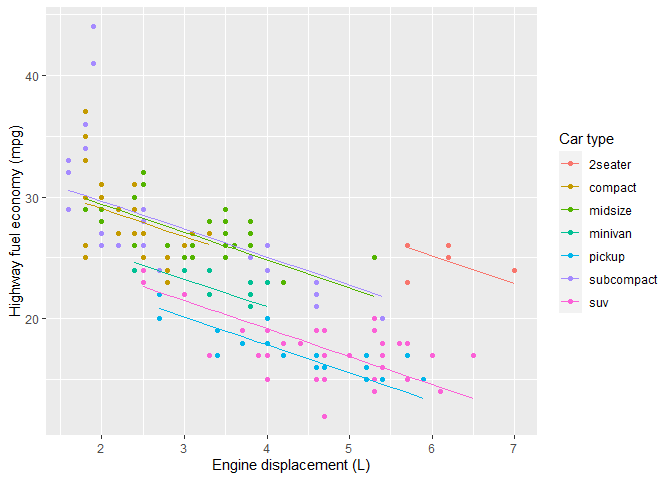
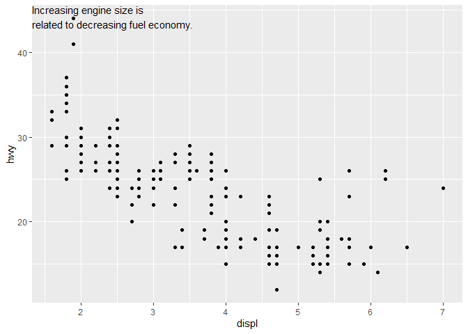
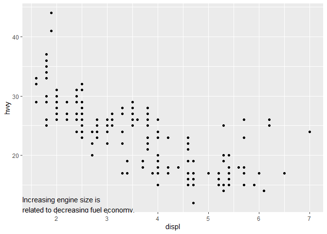
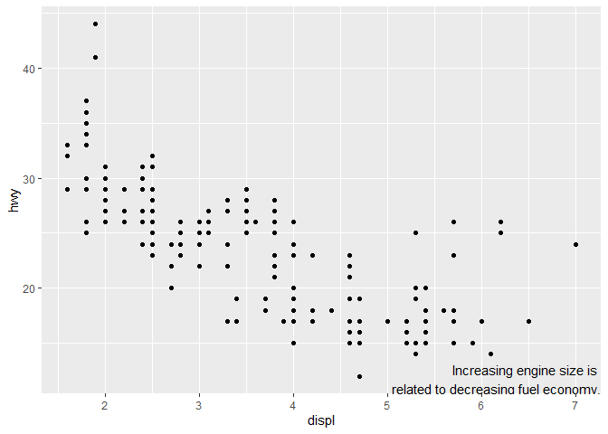
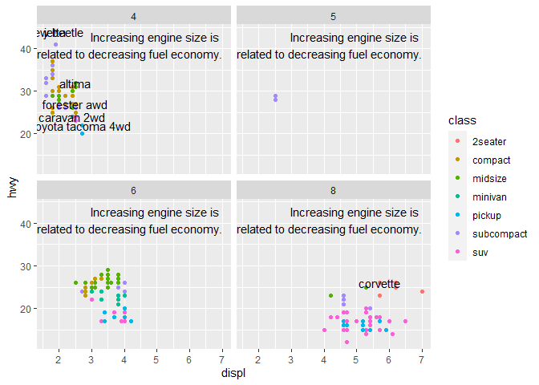
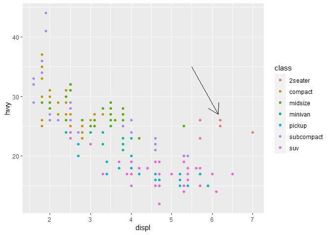
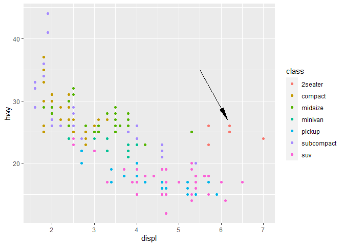
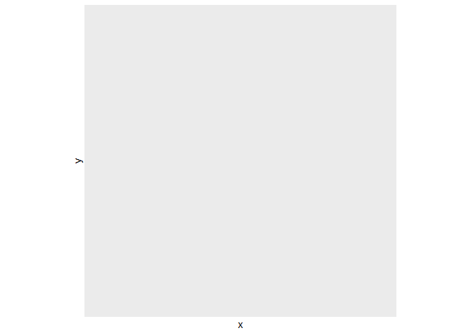
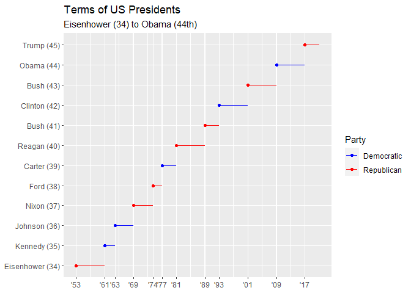
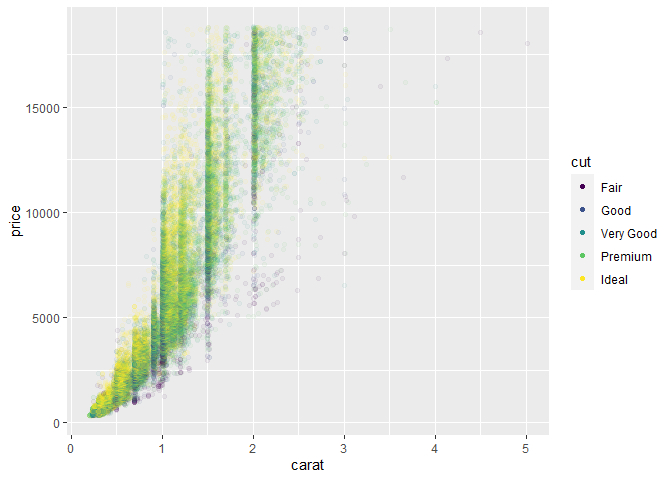

Chapter 28 - Exercises - R for Data Science
================
Francisco Yira Albornoz
March 2nd, 2019

-   [28.2 Label](#282-label)
    -   [28.2.1 Exercises](#2821-exercises)
-   [28.3 Annotations](#283-annotations)
    -   [28.3.1 Exercises](#2831-exercises)
-   [28.4 Scales](#284-scales)
    -   [28.4.4 Exercises](#2844-exercises)

``` r
library(tidyverse)
```

    ## -- Attaching packages --------------------------------------- tidyverse 1.3.1 --

    ## v ggplot2 3.3.5.9000     v purrr   0.3.4     
    ## v tibble  3.1.6          v dplyr   1.0.8     
    ## v tidyr   1.2.0          v stringr 1.4.0     
    ## v readr   2.1.2          v forcats 0.5.1

    ## -- Conflicts ------------------------------------------ tidyverse_conflicts() --
    ## x dplyr::filter() masks stats::filter()
    ## x dplyr::lag()    masks stats::lag()

``` r
library(modelr)
```

## 28.2 Label

### 28.2.1 Exercises

1.  Create one plot on the fuel economy data with customised `title`,
    `subtitle`, `caption`, `x`, `y`, and `colour` labels.

``` r
ggplot(mpg, aes(displ, hwy, color = as.factor(year))) +
  geom_point() +
  geom_smooth(se = FALSE) +
  labs(
    title = "In 2008 cars tend to be more efficient, controlling by engine size",
    subtitle = "However, the magnitude of the difference is small",
    caption = "Data from fueleconomy.gov",
    x = "Engine displacement (L)",
    y = "Highway fuel economy (mpg)",
    colour = "Year"
  )
```

    ## `geom_smooth()` using method = 'loess' and formula = 'y ~ x'

<!-- -->

2.  The `geom_smooth()` is somewhat misleading because the `hwy` for
    large engines is skewed upwards due to the inclusion of lightweight
    sports cars with big engines. Use your modelling tools to fit and
    display a better model.

``` r
model_mpg <- lm(hwy ~ class + displ, data = mpg)

mpg_pred <- mpg %>% 
  add_predictions(model = model_mpg, var = "pred")

ggplot(mpg, aes(displ, hwy, colour = class)) +
  geom_point() +
  geom_line(data = mpg_pred, aes(y = pred)) +
  labs(
    x = "Engine displacement (L)",
    y = "Highway fuel economy (mpg)",
    colour = "Car type"
  )
```

<!-- -->

3.  Take an exploratory graphic that you’ve created in the last month,
    and add informative titles to make it easier for others to
    understand.

``` r
starwars %>% 
  mutate(gender = replace_na(gender, "NA"),
         gender = fct_lump(gender, n = 2)) %>% 
  ggplot(aes(gender, height)) +
  geom_boxplot() +
  labs(
    title = "Males tend to be taller than females in the Star Wars universe",
    subtitle = "However, there is more height dispersion in males than in other genders",
    y = "Height (cm)"
  )
```

    ## Warning: Removed 6 rows containing non-finite values (stat_boxplot).

<!-- -->

## 28.3 Annotations

### 28.3.1 Exercises

1.  Use `geom_text()` with infinite positions to place text at the four
    corners of the plot.

Top-right:

``` r
label <- tibble(
  displ = Inf,
  hwy = Inf,
  label = "Increasing engine size is \nrelated to decreasing fuel economy."
)

ggplot(mpg, aes(displ, hwy)) +
  geom_point() +
  geom_text(aes(label = label), data = label, vjust = "top", hjust = "right")
```

<!-- -->

Top-left:

``` r
label <- tibble(
  displ = -Inf,
  hwy = Inf,
  label = "Increasing engine size is \nrelated to decreasing fuel economy."
)

ggplot(mpg, aes(displ, hwy)) +
  geom_point() +
  geom_text(aes(label = label), data = label, vjust = "top", hjust = "left")
```

<!-- -->

Bottom-left:

``` r
label <- tibble(
  displ = -Inf,
  hwy = -Inf,
  label = "Increasing engine size is \nrelated to decreasing fuel economy."
)

ggplot(mpg, aes(displ, hwy)) +
  geom_point() +
  geom_text(aes(label = label), data = label, vjust = "bottom", hjust = "left")
```

<!-- -->

Bottom-right:

``` r
label <- tibble(
  displ = Inf,
  hwy = -Inf,
  label = "Increasing engine size is \nrelated to decreasing fuel economy."
)

ggplot(mpg, aes(displ, hwy)) +
  geom_point() +
  geom_text(aes(label = label), data = label, vjust = "bottom", hjust = "right")
```

<!-- -->

2.  Read the documentation for `annotate()`. How can you use it to add a
    text label to a plot without having to create a tibble?

This function allows us to directly put an annotation in a plot by
specifying the position coordinates in the function call, as numeric
vectors. An example:

``` r
p <- ggplot(mtcars, aes(x = wt, y = mpg)) + geom_point()
p + annotate("text", x = 4, y = 25, label = "Some text")
```

<!-- -->

3.  How do labels with `geom_text()` interact with faceting? How can you
    add a label to a single facet? How can you put a different label in
    each facet? (Hint: think about the underlying data.)

``` r
best_in_class <- mpg %>%
  group_by(class) %>%
  filter(row_number(desc(hwy)) == 1)

label <- mpg %>%
  summarise(
    displ = max(displ),
    hwy = max(hwy),
    label = "Increasing engine size is \nrelated to decreasing fuel economy."
  )

ggplot(mpg, aes(displ, hwy)) +
  geom_point(aes(colour = class)) +
  geom_text(aes(label = model), data = best_in_class) +
  geom_text(aes(label = label), data = label, vjust = "top", hjust = "right") +
  facet_wrap(~ cyl)
```

<!-- -->

Labels are associated with specific data points in a tibble/dataframe.
If the tibble that contain the labels has a column with the variable
used for faceting, then the labels will be displayed in the
corresponding facet. Otherwise, the label will be repeated in all
facets.

Therefore, to put a different label in each facet we need to create a
tibble with a column that indicates in which facet should be displayed
each label.

4.  What arguments to `geom_label()` control the appearance of the
    background box?

`label.padding` to control the amount of padding around the label,
`label.r` to control the radius of the rounded corners, and `label.size`
to control the size of the label border.

5.  What are the four arguments to `arrow()`? How do they work? Create a
    series of plots that demonstrate the most important options.

The `arrow()` function creates an object that acts as input for the
`arrow` argument in `geom_segment()`. `arrow()` has four arguments:

-   `angle` to specify the aperture angle in the arrow head (in
    degrees).
-   `length` to specify the length of the arrow head.
-   `ends` to specify in which end of the line/segment should the arrow
    head appear.
-   `type` to specify if the arrow head should be an open or closed
    triangle.

``` r
ggplot(mpg, aes(displ, hwy)) +
  geom_point(aes(colour = class)) +
  geom_segment(aes(x = 5.5, y = 35, xend = 6.15, yend = 27), 
               arrow = arrow())
```

<!-- -->

``` r
ggplot(mpg, aes(displ, hwy)) +
  geom_point(aes(colour = class)) +
  geom_segment(aes(x = 5.5, y = 35, xend = 6.15, yend = 27), 
               arrow = arrow(angle = 10, type = "closed"))
```

<!-- -->

``` r
ggplot(mpg, aes(displ, hwy)) +
  geom_point(aes(colour = class)) +
  geom_segment(aes(x = 5.5, y = 35, xend = 6.15, yend = 27), 
               arrow = arrow(angle = 45, type = "open", unit(0.15, "inches")))
```

<!-- -->

## 28.4 Scales

### 28.4.4 Exercises

1.  Why doesn’t the following code override the default scale?

``` r
df <- tibble(
  x = rnorm(10000),
  y = rnorm(10000)
)

ggplot(df, aes(x, y)) +
  geom_hex() +
  scale_colour_gradient(low = "white", high = "red") +
  coord_fixed()
```

    ## Warning: Computation failed in `stat_binhex()`:

<!-- -->

Because the aesthetic we want to change is `fill`, not `colour`. We can
override the default scale by using `scale_fill_gradient`.

2.  What is the first argument to every scale? How does it compare to
    `labs()`?

`name` is the first argument in every scale function. Its default value
is `waiver()` which is a function that returns the name of the first
variable that was mapped to that aesthetic.

In comparison, the first argument in `labs()` is a set of name-value
pairs used to rename the scales (where “name” should be an aesthetic
included in the plot).

3.  Change the display of the presidential terms by:

4.  Combining the two variants shown above.

5.  Improving the display of the y axis.

6.  Labelling each term with the name of the president.

7.  Adding informative plot labels.

8.  Placing breaks every 4 years (this is trickier than it seems!).

``` r
start_year_plot <- lubridate::year(min(presidential$start))
end_year_plot <- lubridate::year(max(presidential$start))
seq_years <- seq(start_year_plot, end_year_plot, by = 4)

fouryears <- lubridate::make_date(seq_years, 1, 1)

presidential_plot <- presidential %>%
  mutate(id = 33 + row_number(),
         label_period = str_c(name, " (", id, ")"))

ggplot(presidential_plot, aes(start, id, colour = party)) +
  geom_point() +
  geom_segment(aes(xend = end, yend = id)) +
  scale_colour_manual(name = "Party",
                      values = c(Republican = "red", Democratic = "blue")) +
  scale_y_continuous(
    name = NULL,
    labels = presidential_plot$label_period,
    breaks = presidential_plot$id,
    minor_breaks = NULL
  ) +
  scale_x_date(
    NULL,
    breaks = presidential_plot$start,
    date_labels = "'%y",
    minor_breaks = fouryears
  ) +
  labs(title = "Terms of US Presidents",
       subtitle = "Eisenhower (34) to Obama (44th)")
```

<!-- -->

4.  Use `override.aes` to make the legend on the following plot easier
    to see.

``` r
ggplot(diamonds, aes(carat, price)) +
  geom_point(aes(colour = cut), alpha = 1/20) +
  guides(colour = guide_legend(override.aes = list(alpha = 1)))
```

<!-- -->
